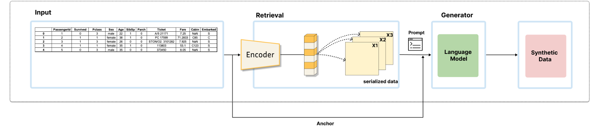
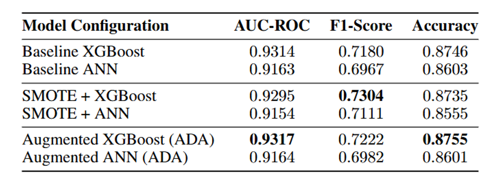

# ADA: Automatic Data Augmentation via LLM

📢 2025년 1학기 [AIKU](https://github.com/AIKU-Official) 활동으로 진행한 프로젝트입니다

## 소개

LLM의 추론 능력을 활용하여 tabular 데이터의 소수 클래스를 증강하는 자동 데이터 증강(ADA)하는 프레임 워크

## 방법론

데이터 증강을 위한 ADA 프레임워크와, 증강된 데이터의 효과를 검증하기 위한 분류 모델로 구성됩니다

- ADA 프레임워크: RAG 기반 3-Step workflow
    - Indexing
        - tabular 데이터의 각 행을 텍스트 형식으로 serialize
        - serialize된 텍스트를 임베딩 모델을 사용해 고차원 벡터로 변환
        - 변환된 벡터들을 빠른 검색을 위해 vector DB에 저장
    - Context Retrieval
        - 데이터 증강의 기준이 될 anchor를 하나 선택
        - vector DB에서 anchor와 vector공간 상에 가장 유사한 k개의 context를 검색
    - LLM Generation
        - anchor data와 검색된 context data를 결합하여 LLM에 전달할 프롬프트를 수정
        - 이 프롬프트를 LLM에 입력해서 anchor와 context의 정보를 바탕으로 논리적으로 일관성있는 새로운 데이터 샘플을 생성
       
    
    ---
    
    - 이를 위해 아래의 모델들을 사용
        - Embedding Model(all-MiniLM-L6-v2): RAG의 retriever 역할을 수행하고 tabular data의 각 행을 serialized 하여 텍스트로 변환한 후 vector로 임베딩하고 vector DB에 저장
        - Generator Model(GPT-4o mini): anchor 데이터와 RAG를 통해 검색된 유사 context를 입력받아 ‘impossible sampling’을 수행후 데이터를 생성하는 LLM. 이때 아래의 프롬프트 엔지니어링 기법이 사용됨.
            - Persona Assignment: LLM에게 특정 도메인 전문가 역할을 부여하여 깊이 있는 데이터 생성을 유도
            - Chain-of-Thought: 공통 특성 분석→주요변수 식별→시나리오 가설수립→최종 데이터생성의 단계적 사고를 통해 논리적으로 일관성 있는 데이터 생성
- 분류 모델
    - XGBoost: tabular 데이터에서 강력한 성능을 보이는 Gradient Boosting 모델로 baseline 성능을 측정하고 증강된 데이터의 효과를 검증하기 위해 사용
    - ANN(단순 이진분류 신경망): 기본적인 신경망 구조를 통해 다른 종류의 모델에서도 증강 데이터가 효과적인지 교차 검증을 위해 사용

## 사용 방법

코랩 환경에서 실행 가능

## 예시 결과

ADA 프레임워크를 통해 증강된 데이터로 학습한 모델은 Baseline 대비 AUC-ROC 및 Accuracy에서 소폭의 성능 향상을 보였습니다.

## 팀원

- [이나라](https://github.com/lnl0909): (문제 정의, 레퍼런스 조사, 모델링 및 평가)
